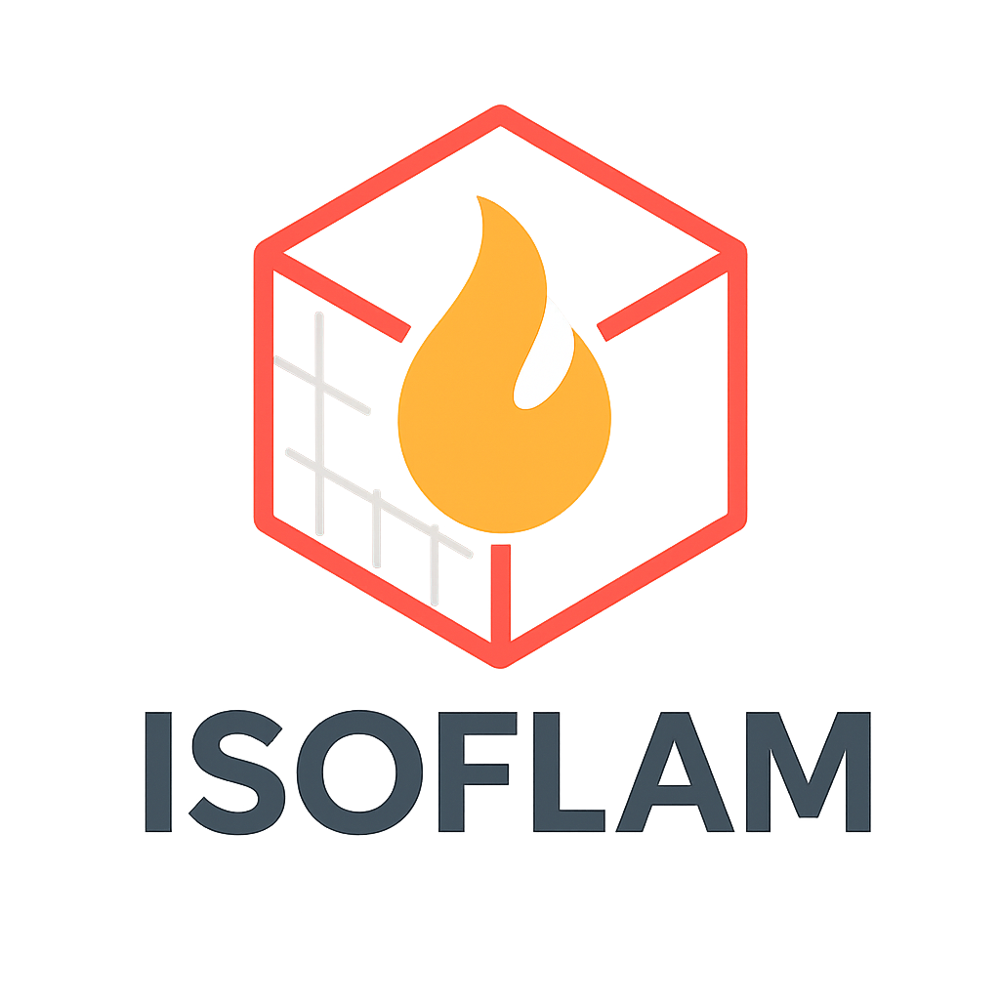
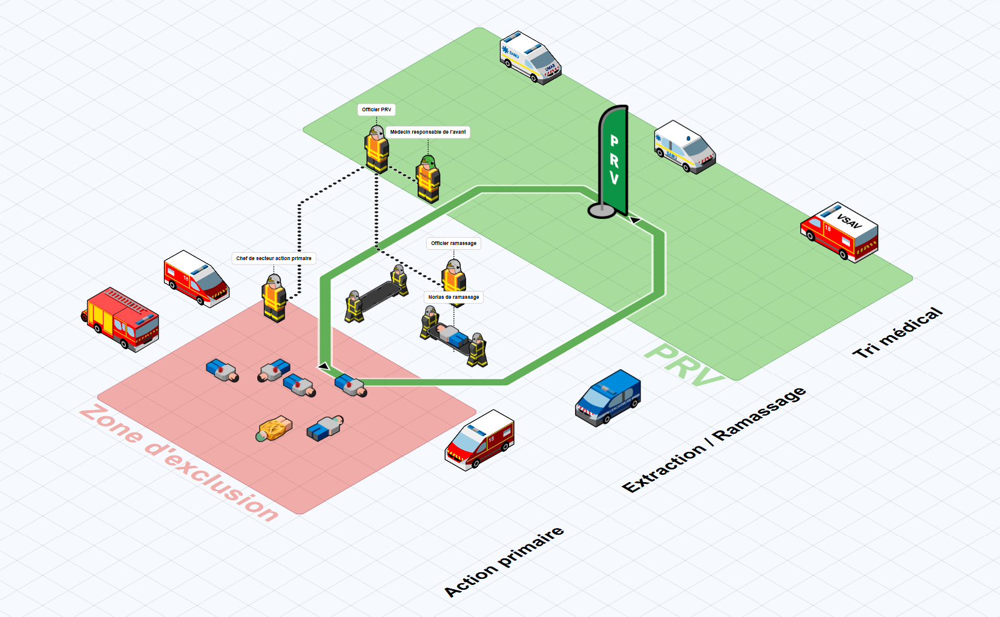
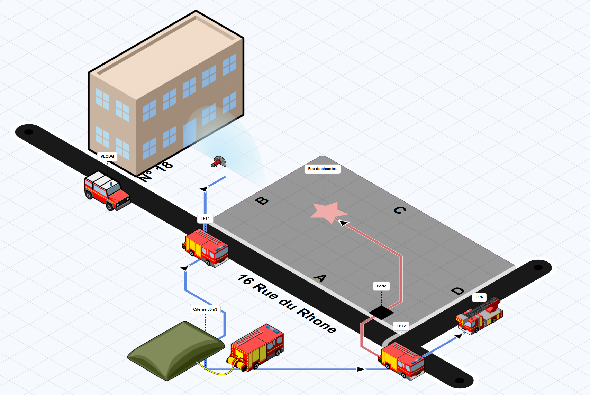
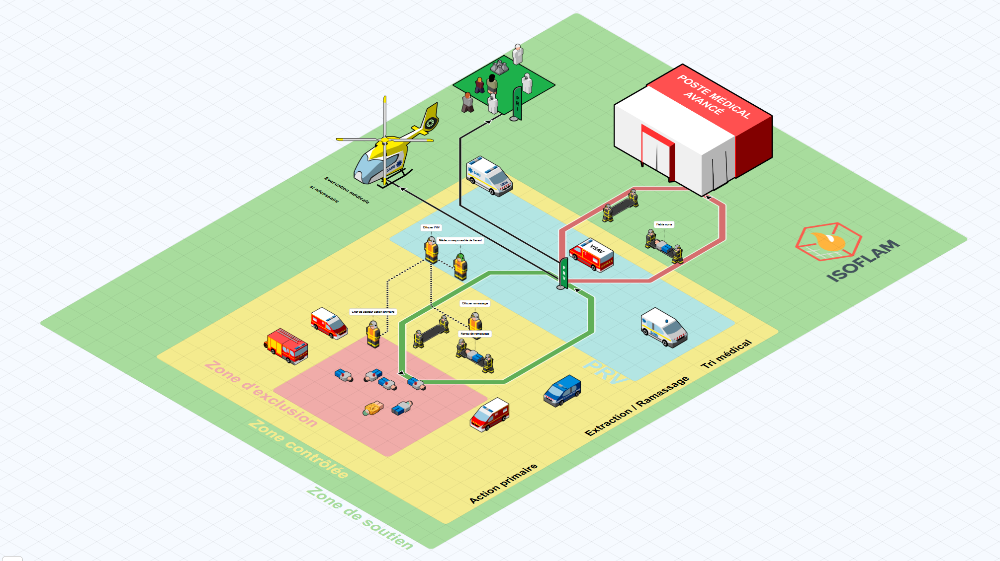

<div align="center">

</div>

<div align="center">
    <h1>Isoflam - Isometric Drawing Software for Firefighters</h1>
</div>

<div align="center">

[](https://github.com/isaratech/isoflam/releases)
[](https://creativecommons.org/licenses/by-nc-sa/4.0/)
[](https://reactjs.org/)
[](https://www.typescriptlang.org/)
[](https://mui.com/)
[](https://hub.docker.com/r/isaratech/isoflam)
[](https://github.com/isaratech/isoflam/actions)

</div>

## About Isoflam

Isoflam is an isometric drawing software designed for firefighters. It allows quick scene modeling by placing elements such as vehicles, personnel, and equipment, drawing shapes, arrows, or zones, and adding text. The final diagram can be exported as an image to support operational communication or post-incident reporting.

## 🚀 Live Demo

Try the application online: **[https://isaratech.github.io/isoflam/](https://isaratech.github.io/isoflam/)**

## Application Preview

<div align="center">
  
  
  
</div>

*Example of Isoflam application interface showing isometric scene modeling*

## Key Features

- **Drag-and-drop editor** - Quickly place firefighting vehicles, personnel, and equipment on your scene
- **Specialized icon library** - Comprehensive collection of firefighting-specific icons and symbols
- **Drawing tools** - Create shapes, arrows, zones, and add text annotations
- **Export capabilities** - Export diagrams as high-quality images for reports and communications
- **Isometric view** - Professional 3D-like perspective for clear scene representation

## 🛠️ Technology Stack

### Frontend

- **React 18.2.0** - Modern React with hooks and functional components
- **TypeScript 5.1.6** - Type-safe JavaScript development
- **Material-UI 5.11.10** - React component library for consistent UI design
- **Emotion** - CSS-in-JS library for styling
- **Zustand 4.3.3** - Lightweight state management

### Graphics & Animation

- **Paper.js 0.12.17** - Vector graphics scripting framework for isometric drawing
- **GSAP 3.11.4** - High-performance animation library
- **dom-to-image 2.6.0** - Library for converting DOM nodes to images

### Development Tools

- **Webpack 5** - Module bundler and build tool
- **Jest 29** - JavaScript testing framework
- **React Testing Library** - Testing utilities for React components
- **ESLint & Prettier** - Code linting and formatting
- **TypeScript** - Static type checking

### Additional Libraries

- **React Hook Form 7.43.2** - Performant forms with easy validation
- **React Quill 2.0.0** - Rich text editor component
- **Zod 3.22.2** - TypeScript-first schema validation
- **Chroma.js 2.4.2** - Color manipulation library
- **UUID 9.0.0** - Unique identifier generation

## Development Support

This development is supported by:
- **[Isara Technologies](https://isaratech.com)** - [GitHub](https://github.com/isaratech)
- **[HORUS](https://gohorus.fr)**

## Credits and Acknowledgments

### Based on Isoflow Library
This application is built upon the [Isoflow](https://github.com/markmanx/isoflow) library by Mark Mankarious, an open-source React component for drawing network diagrams.

### SDMIS Icons
The firefighting icons used in this application are provided by the **Service Départemental-Métropolitain d'Incendie et de Secours (SDMIS), 2023. All rights reserved.**

These icons are licensed under [Creative Commons CC BY-NC-SA 4.0](https://creativecommons.org/licenses/by-nc-sa/4.0/deed.fr) and are used in accordance with the attribution requirements.

## License

This project is licensed under the [Creative Commons Attribution-NonCommercial-ShareAlike 4.0 International License](https://creativecommons.org/licenses/by-nc-sa/4.0/).

## 🐳 Docker Image

The Docker image is available on Docker Hub: **[https://hub.docker.com/r/isaratech/isoflam](https://hub.docker.com/r/isaratech/isoflam)**

```bash
docker pull isaratech/isoflam:latest
docker run -p 80:80 isaratech/isoflam:latest
```

For detailed Docker usage instructions, see [README-dockerhub.md](README-dockerhub.md).

## 🔄 Continuous Integration

This project uses GitHub Actions for continuous integration:
- **Build and Test**: Automatically runs linting, tests, and build process on all pushes and pull requests
- **GitHub Pages**: Deploys the application to GitHub Pages on pushes to main/master branches
- **Docker Publish**: Builds and publishes Docker image on pushes to main/master branches

## 🚀 Installation and Development

### Prerequisites

- **Node.js** (version 16 or higher)
- **npm** (version 7 or higher)

### Quick Start
```bash
# Clone the repository
git clone https://github.com/isaratech/isoflam.git
cd isoflam

# Install dependencies
npm install

# Start development server
npm start
```

The application will be available at `http://localhost:3000`.

### Available Scripts

| Script                 | Description                                            |
|------------------------|--------------------------------------------------------|
| `npm start`            | Starts the development server with hot reload          |
| `npm run dev`          | Starts development with file watching and auto-rebuild |
| `npm run build`        | Creates optimized production build                     |
| `npm test`             | Runs the test suite with Jest                          |
| `npm run lint`         | Runs ESLint to check code quality                      |
| `npm run lint:fix`     | Automatically fixes ESLint issues                      |
| `npm run docker:build` | Builds Docker-optimized version                        |

### Development Workflow

1. **Development Server**: Use `npm start` for hot reload during development
2. **Code Quality**: Run `npm run lint` before committing changes
3. **Testing**: Execute `npm test` to run all tests
4. **Production Build**: Use `npm run build` for deployment

### Testing

The project uses **Jest** and **React Testing Library** for comprehensive testing:

```bash
# Run all tests
npm test

# Run tests in watch mode
npm test -- --watch

# Run tests with coverage report
npm test -- --coverage
```

### Browser Compatibility

- **Production**: Modern browsers (>0.2% usage, not dead, not Opera Mini)
- **Development**: Latest Chrome, Firefox, and Safari versions
- **Supported**: Chrome 90+, Firefox 88+, Safari 14+, Edge 90+

## 🌍 Internationalization

Isoflam supports multiple languages with automatic browser locale detection:

- **French (fr)** - Complete translation with specialized firefighting terminology
- **English (en)** - Full English support with fallback capability
- **Auto-detection** - Automatically detects browser language with English fallback

## 📋 What's New in v1.2.1

### Latest Features (July 2025)

- ✨ **Enhanced Font Controls** - Visual font size selector with icons
- 🎯 **Drag & Drop Support** - Import JSON model files directly
- 🌐 **Complete Internationalization** - French and English language support
- 📝 **Rich Text Formatting** - Bold and italic text controls
- 🔧 **Improved UI** - Better organization with advanced settings accordion
- 📖 **French Documentation** - Comprehensive user manual in French

For complete changelog, see [CHANGELOG.md](CHANGELOG.md).

## 📚 Documentation

- **[User Manual (French)](docs/manuel_utilisateur.md)** - Complete guide in French
- **[Changelog](CHANGELOG.md)** - Detailed version history
- **[Docker Hub](https://hub.docker.com/r/isaratech/isoflam)** - Container deployment guide

## Contributing

Contributions are welcome! Please ensure that any contributions comply with the CC BY-NC-SA 4.0 license terms.

## Support

For support and questions, please open an issue on the [GitHub repository](https://github.com/isaratech/isoflam/issues).
