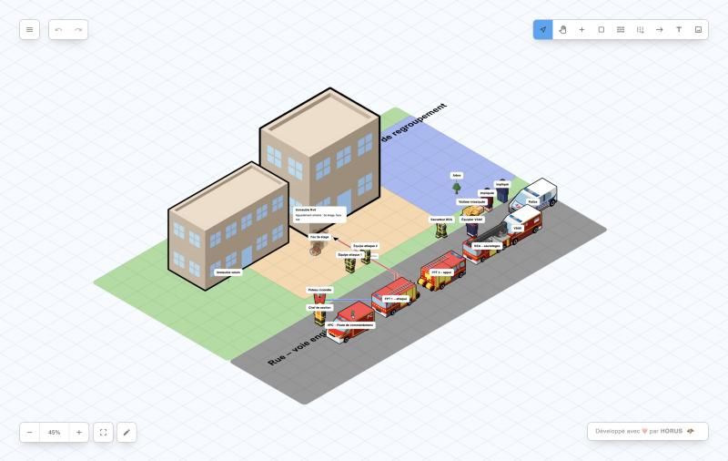
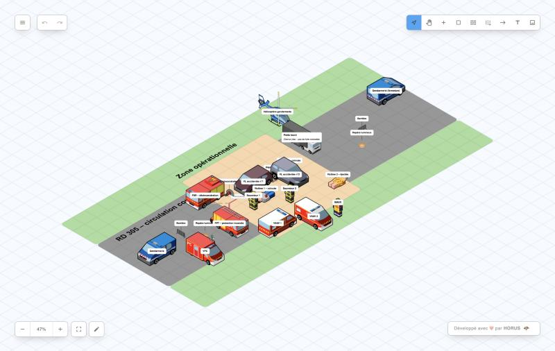
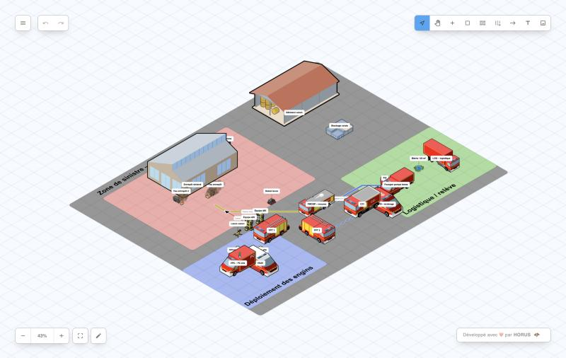
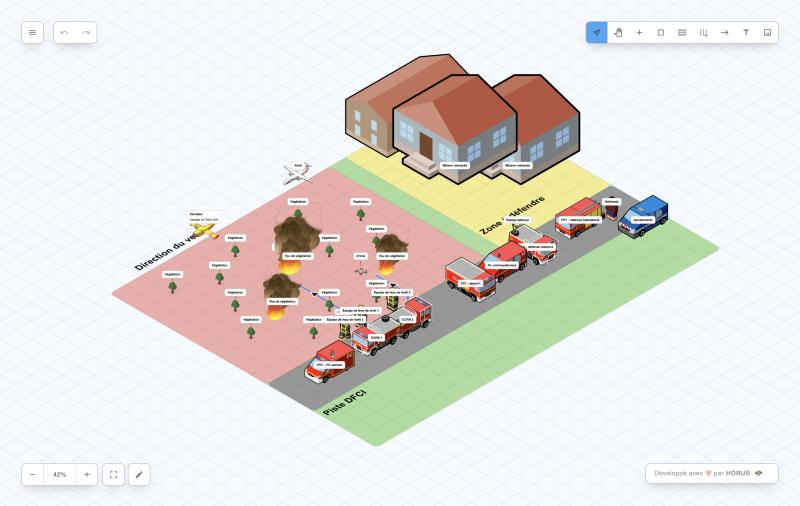
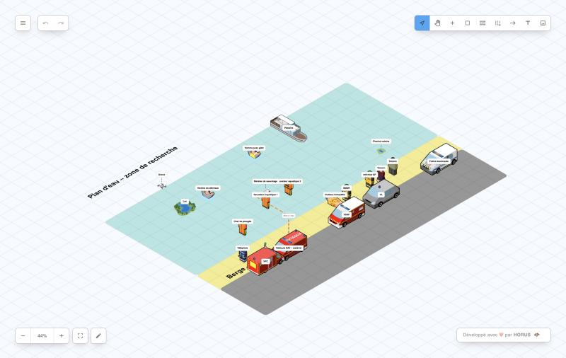
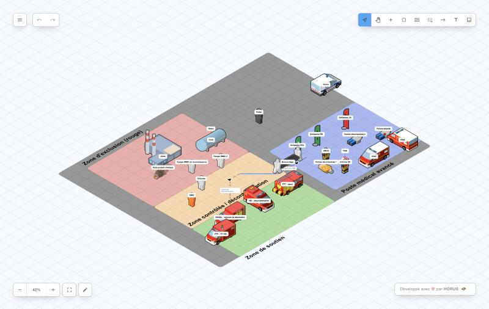

# Scènes d'exemple – interventions de sapeurs-pompiers

*Example scenes – firefighting operations (English summary at the bottom).*

Six scènes d'exemple prêtes à l'emploi, construites avec la bibliothèque d'icônes SDMIS d'Isoflam (bâtiments, engins, personnels, victimes, matériels). Chaque scène est fournie avec sa capture d'écran et son fichier JSON.

| # | Scène | Capture | JSON |
|---|-------|---------|------|
| 1 | **Feu d'appartement – immeuble R+5** : attaque par l'intérieur, sauvetage par BEA, prise en charge des impliqués |  | [01_feu_immeuble.json](01_feu_immeuble.json) |
| 2 | **Accident routier – désincarcération** : collision VL / poids lourd, FSR, balisage, SUAP, hélicoptère de la gendarmerie |  | [02_accident_routier.json](02_accident_routier.json) |
| 3 | **Feu d'entrepôt logistique** : lances canon, mousse, bâche, robot lance, drone, zones de déploiement et de logistique |  | [03_feu_entrepot.json](03_feu_entrepot.json) |
| 4 | **Feu de forêt – interface habitat** : CCFM, défense des habitations, Canadair et Dash, drone |  | [04_feu_foret.json](04_feu_foret.json) |
| 5 | **Sauvetage aquatique – noyade** : sauveteurs aquatiques, embarcation, SMUR, réchauffement des victimes |  | [05_sauvetage_aquatique.json](05_sauvetage_aquatique.json) |
| 6 | **Intervention NRBC** : zones d'exclusion et de décontamination, poste médical avancé, brancardage |  | [06_nrbc_pma.json](06_nrbc_pma.json) |

## Ouvrir une scène

1. Ouvrir [Isoflam](https://isaratech.github.io/isoflam/).
2. Menu principal → **Ouvrir**, puis choisir l'un des fichiers `.json` de ce dossier.
3. Modifier la scène à volonté, puis **Exporter en JSON** ou **Exporter en image**.

## Format des fichiers

Les JSON de ce dossier sont volontairement **allégés** : ils référencent les icônes SDMIS par leur identifiant (`sdmis_…`) et n'embarquent pas les icônes elles-mêmes, contrairement à l'export natif de l'application (plusieurs Mo). Le champ `icons` est optionnel : Isoflam utilise alors sa bibliothèque intégrée.

Structure d'un fichier :

- `items` : éléments du modèle (`id`, `name`, `icon`, `description` optionnelle) ;
- `views[0].items` : position de chaque élément (`tile: {x, y}`, `scaleFactor` optionnel) ;
- `views[0].rectangles` : zones colorées (`from`, `to`, `color`, `style`) ; le premier rectangle du tableau est dessiné au-dessus des suivants ;
- `views[0].connectors` : liaisons entre éléments ou tuiles (alimentation, établissements, évacuations) ;
- `views[0].textBoxes` : annotations de zones.

## English summary

Six ready-to-use example scenes (apartment fire, road accident with extrication, warehouse fire, wildfire at the wildland-urban interface, water rescue, CBRN decontamination line) built with the SDMIS icon library. Open them via **Main menu → Open** and choose a `.json` file from this folder. The files are lightweight: icons are referenced by id and not embedded, so Isoflam falls back to its built-in library.
